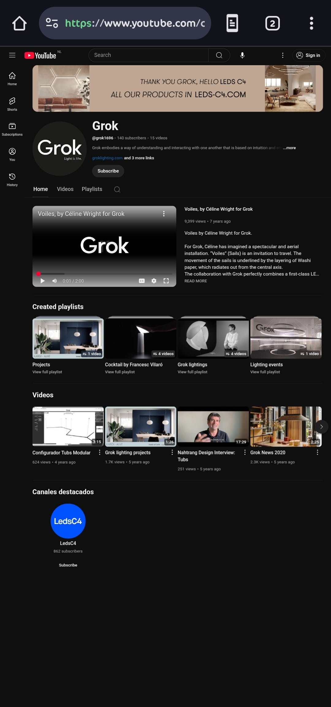
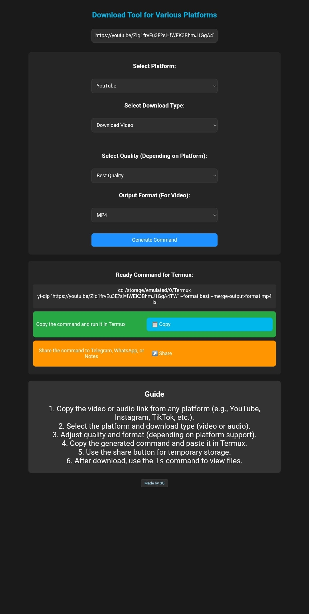
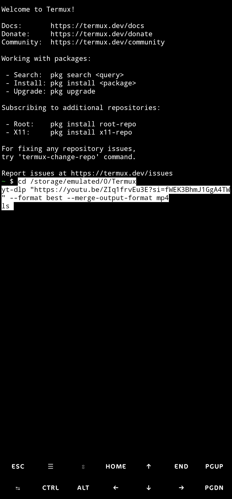

## 🎬 yt-dlp Link Generator for Termux

**yt-dlp Link Generator** is a simple and user-friendly tool that helps you automatically generate `yt-dlp` commands to download videos or audio from YouTube within the Termux environment. Designed with an easy-to-use interface, this tool enhances the downloading experience for Android users.

🔗 [English Version🇮🇷](README.fa.md)

## ⚠️ Important Security Notes
- 🔑 Your cookies are like the key to your account — **never share them** with anyone!
- ⏳ Cookies have an expiration date — if you get the error again, export a fresh cookies file.
- ✅ This method is safe and legal — it works just like watching the video in your own browser.

With this method, you can download any video **without CAPTCHA or “Sign in” errors**!

## 📌 🚩 Fixing `Sign in to confirm you’re not a bot` Error
Sometimes YouTube shows the message:  
**“Sign in to confirm you’re not a bot.”**  
This means you must be logged in or pass a CAPTCHA to download the video.
---
## ⚙️ Quick Solution
✅ The only reliable solution is to use your browser cookies:  
1️⃣ Log in to YouTube with your account.  
2️⃣ Export your browser cookies.  
3️⃣ Pass the cookies to yt-dlp.
---
## 🧩 Step-by-Step Guide
### ✅ 1️⃣ Install a Cookie Export Extension
🔹 **PC:**  
- Use **Chrome**, **Edge**, or **Firefox**.  
- Install [Get cookies.txt](https://chrome.google.com/webstore/detail/get-cookiestxt/hnimpnehoodheedghdeeijklkeaacjfo)  
  or [EditThisCookie](https://chrome.google.com/webstore/detail/editthiscookie/fngmhnnpilhplaeedifhccceomclgfbg).
  🔹 **Android (Mobile):**  
- Install [Kiwi Browser](https://play.google.com/store/apps/details?id=com.kiwibrowser.browser).  
- Open [Chrome Web Store](https://chrome.google.com/webstore) and install the same extensions.
  ---
  ### ✅ 2️⃣ Export Your Cookies
  - Log in to [YouTube](https://youtube.com) (make sure you’re signed in).
- Click the extension icon.
- Select **Export cookies to cookies.txt**.
- Save the `cookies.txt` file.
  ---
## 📸 Screenshots
Here are some screenshots showcasing the tool in action:

  
*The YouTube channel page for Grok, captured from the browser.*

  
*Interface showing the tool generating a link with a YouTube URL, platform selection, and command options.*

  
*Termux terminal initiating the download process after receiving the generated command.*

  
*Termux terminal showing the successful completion of the download process.*
---
